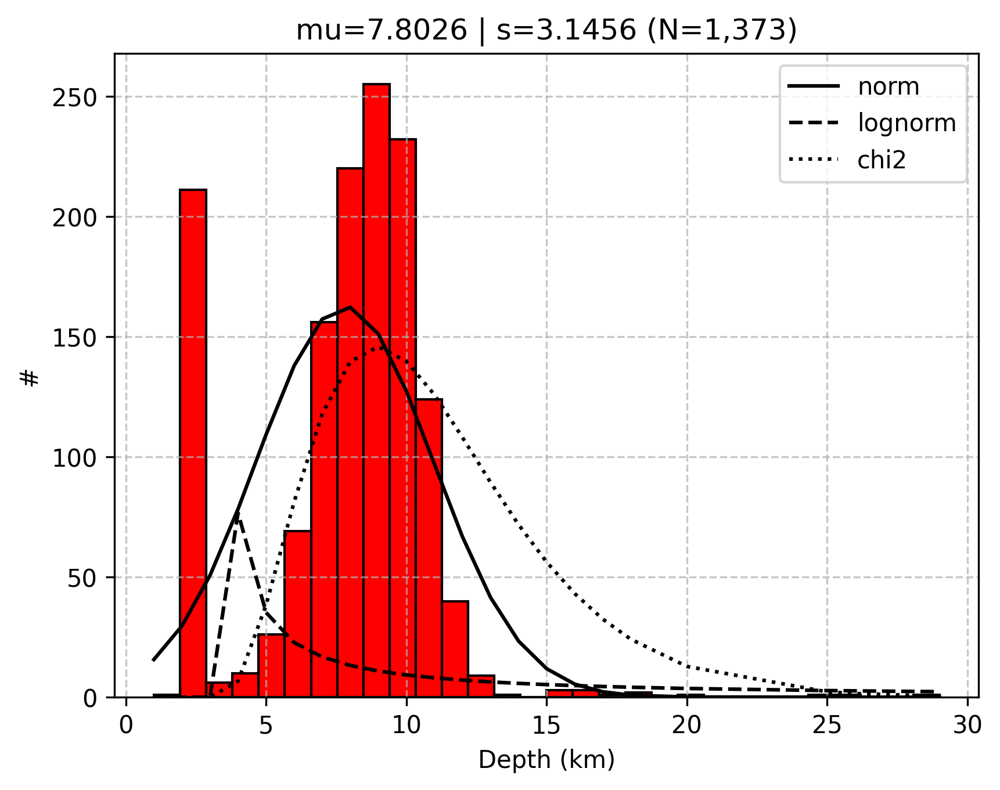
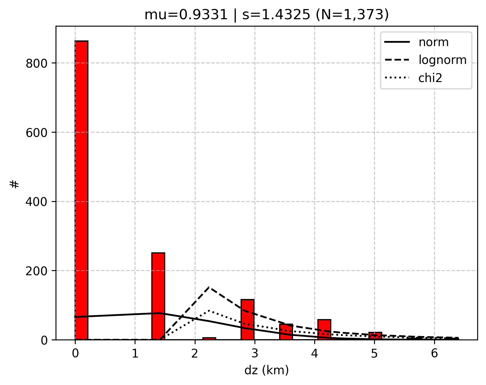
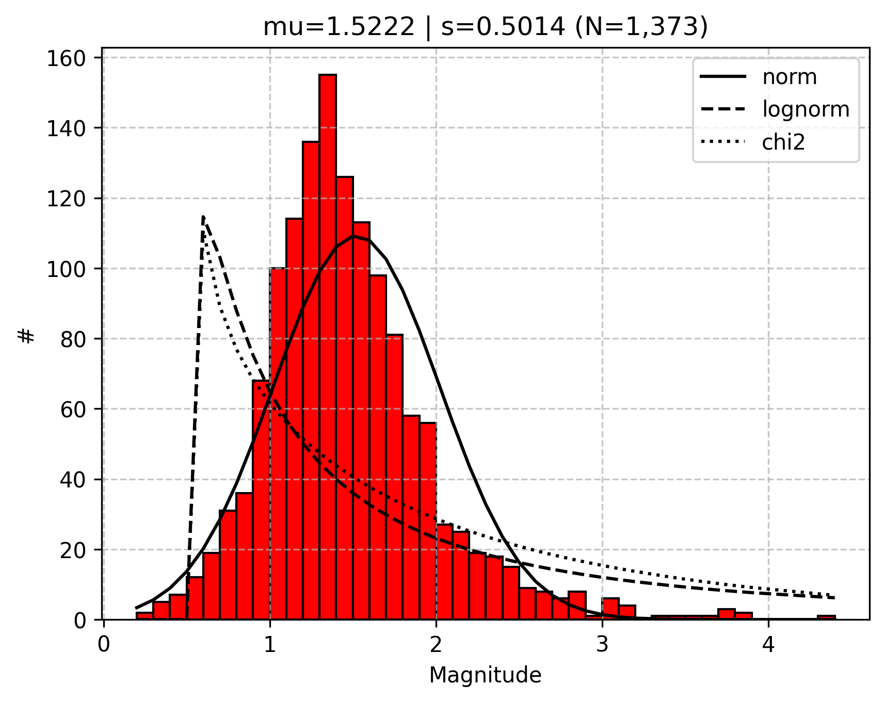
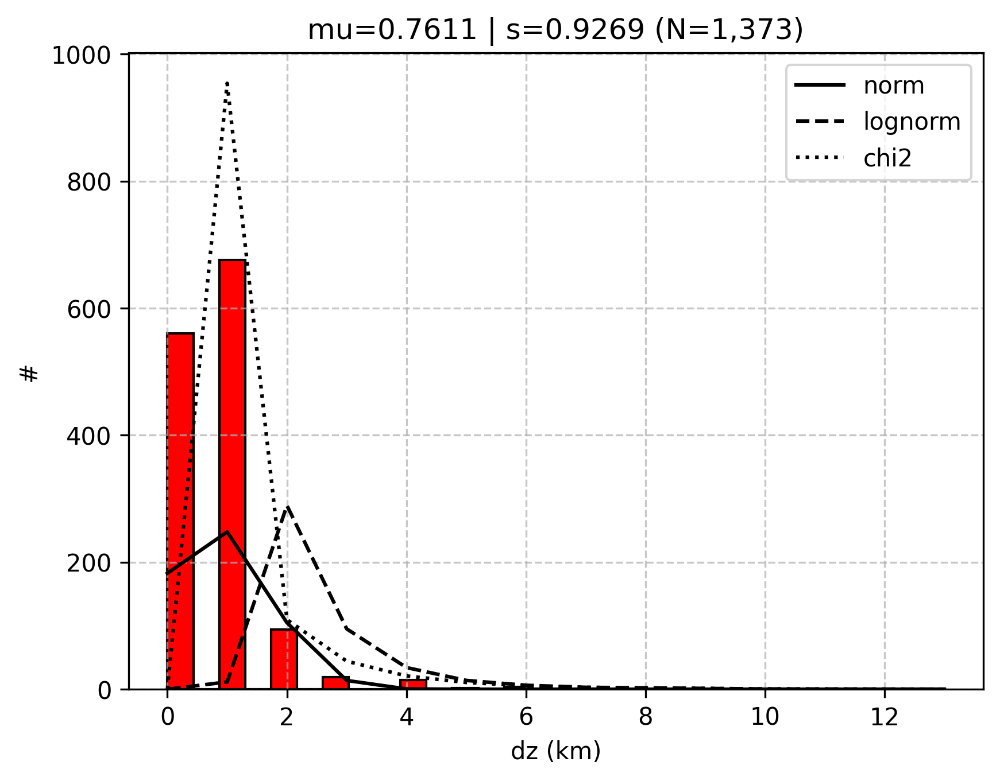
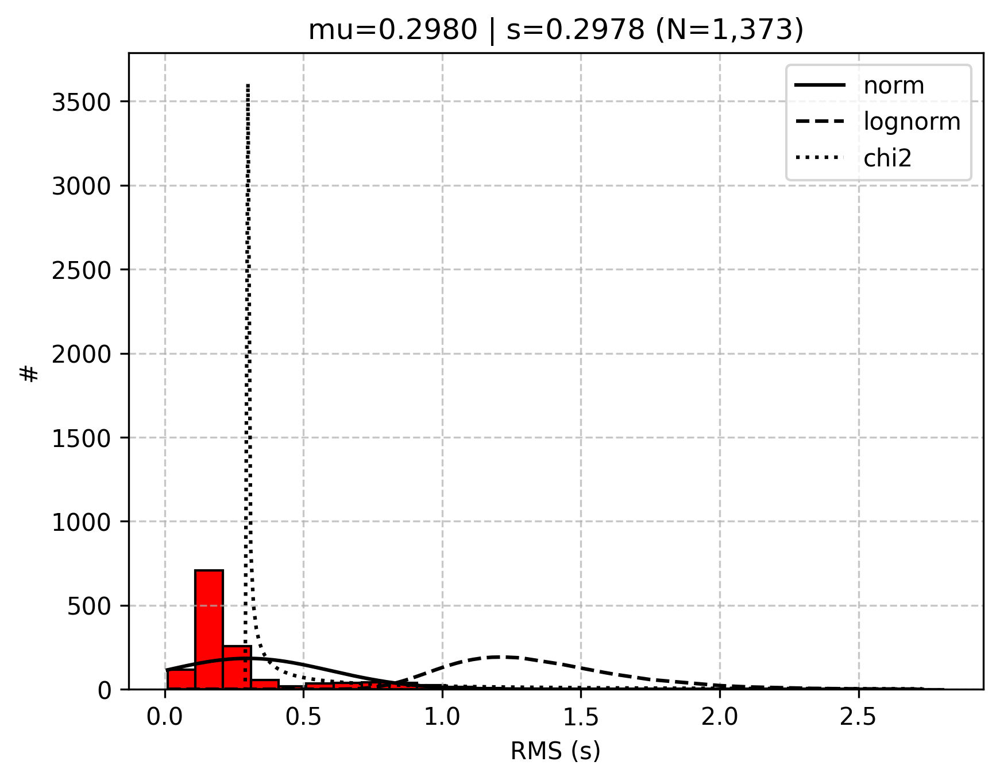

# Statistical-analysis-and-visualization-of-seismic-magnitude-and-depth-quantities
## Python libraries used:
- Pandas
- Numpy
- Matplotlib
- scipy

## Sample outputs
### DEP

### DH

### Magnitude

### DZ

### RMS

